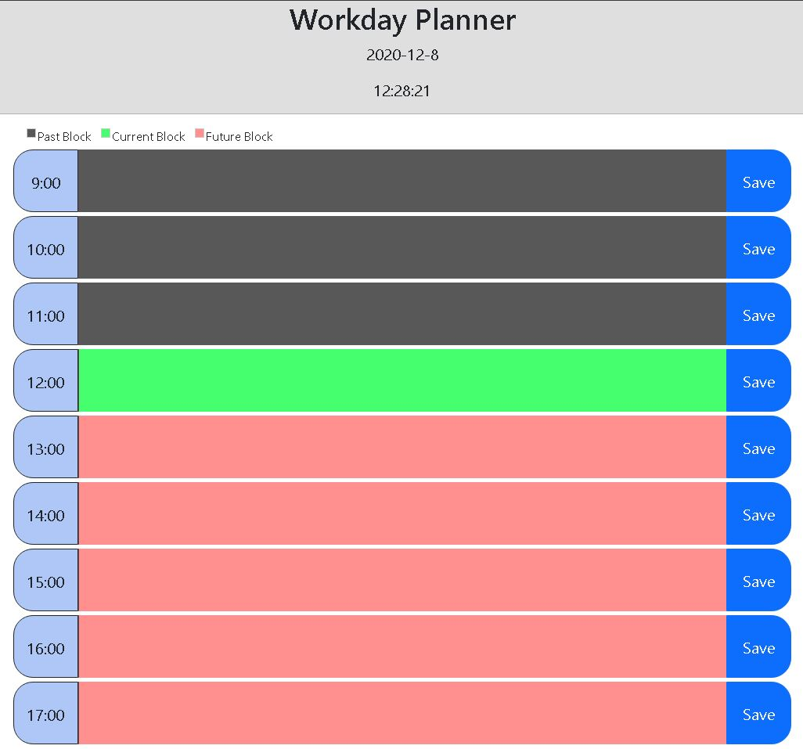

# Workday Planner

## Project Overview

### To create a Workday Planner that:
- Show the current day at the top of the page.
- User is presented with time blocks for standard business hours
- Blocks are color-coded for past,present, and future
- when a block is clicked on, the user can enter text
- When the user hits the save button, the input is saved in local storage
- When page is refreshed, the saved events persis

## Tools used in creating the generator
- Moment.js
- Javascript
- HTML
- Bootstrap
- jQuery
- CSS

## Issues resolved
- Had to rush through this project due to family matters, so its kind of bland in regares to the styling
- The prior assignment really helped in creating this, so I had little issues with it.

## Link to Site
https://amarz94.github.io/workday-planner/.

### Contact Info
- Email: marzullo94@gmail.com
